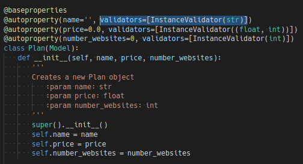

# Licensing System

To accomplish the requirements I’ve decided to implement a small `ORM` to manipulate the data. This is really inspired by the `django` ORM (QuerySets) and others like `Laravel`’s `eloquent` ORM. All models are defined inside `models` and each model has a set of utility methods to manipulate the internal storage. I’ve decided to not implement a database connection, although this can be achieved very easily because the basic read and write operations are constrained to a single point (`models/model.py`).

There are a set of decorators that helps build a model very easily and can be attached and interchangeable between models. Those are:

- `@baseproperties` - __Required__. Defines the basic properties that all models should have (auto-increment `id`, `created_at` and `updated_at`).

- `@autoproperty` - Optional. Creates a custom property on the model. It works by accepting a set of keyword arguments (_kwargs_), being the first key corresponding to the name of the property and its value to the default value of that property. All other keywords are treated as settings switches to that property. The switches follows:
    - `hasGet` blocks get operation
    - `hasSet` blocks set operations (Property `id` from all models has this flag)
    - `validators` a list of validators to apply to every set operation. See the Validator documentation for more information.

Once the model is defined, one can retrieve, create, update and remove objects of that model. Let’s take, for instance, the Plan model that lives in `models/plan.py`.



This model has three custom properties: `name`, `price`, `number_websites` (also the basic properties `id`, `created_at`, `updated_at`). As we can see from the validators - using our custom InstanceValidator (only accepts values from the specified class or classes) - `name` only accepts string values, `price` only accepts integers or floats and `number_websites` only accepts integers. This gives us a huge flexibility when defining models and also reduces code duplication.

All models inherits from the base model class. Therefore they implement all the same api. Every property can be accessed through its name on the object, beyond that they have two other methods (__instance methods__) to help manipulating instances.

- `Model.save` - Saves the instance to the underlying storage.
- `Model.remove` - Deletes the instance from the underlying storage.


Besides that,  I’ve also created common methods to all classes that inherit from the Model class (__@classmethods__).

- `Model.all` - Returns all known objects of that model.
- `Model.create` - Creates a new object of that model and saves to the underlying storage.
- `Model.find` - Searches for all the objects of that model that matches the supplied properties subset. E.g.:

```python
ret = ModelTest.find({'name': 'abc'})
self.assertEqual(len(ret), 1)
```

- `Model.find_one` - Search for a single object of that model that matches the supplied properties subset. E.g.:

```python
m1 = ModelTest.create('abc')
ret = ModelTest.find_one({'name': 'abc'})
self.assertEqual(ret, m1)
```

- `Model.count` - Return the number of objects that matches the supplied properties subset.

## Validators

Properties can have validators attached to it, se we can block invalid data from being set to the system. There are three validators implemented:

- `EmailValidator` - Matches the regex `[a-z0-9\.\-\_\+]+@[a-z0-9\.\-\_]` (ignoring the case).

- `NotNoneValidator` - Matches every value that is not `None`

- `InstanceValidator` - It accepts a class or a tuple of classes and returns true if `isinstance` returns true, false otherwise. Its is implemented on top of `NotNoneValidator`, therefore it blocks `None` values.


## Queries

To enhance the query system over the models. I've created the `QueryProps`. It is an interface that defines how a property should be compared. It basically overrides the `__eq__` method to a custom defined operation. I've implemented four `QueryProps`, they are:

- `GTProp` - matches values greater than the query.
- `GTEProp` - matches values greater than or equal to the query.
- `LTProp` - matches values less than the query.
- `LTEProp` - matches values less than or equal to the query.

E.g.: The class methods `get_expired_subscription` is implemented based on `LTProp`:

```python
@classmethod
def get_expired_subscriptions(self):
    '''
    Returns the expired subscriptions. i.e.: With renewal date before the current time
    :rtype list(Subscription):
    '''
    return Subscription.find({ 'renewal_date': LTProp(datetime.now()) })
```

## Development and final considerations

All the code was developed in VSCode using a docker container built on top of `python:3.7`. No extra requirements are necessary, despite having a `Pipfile`.

This was a really fun project to implement. I've had the opportunity to reason about OO design and software architecture. I've implemented in a way that is scalable and maintainable by trying to reduce code duplication and to keep a clean api based on well established designs and patterns.

